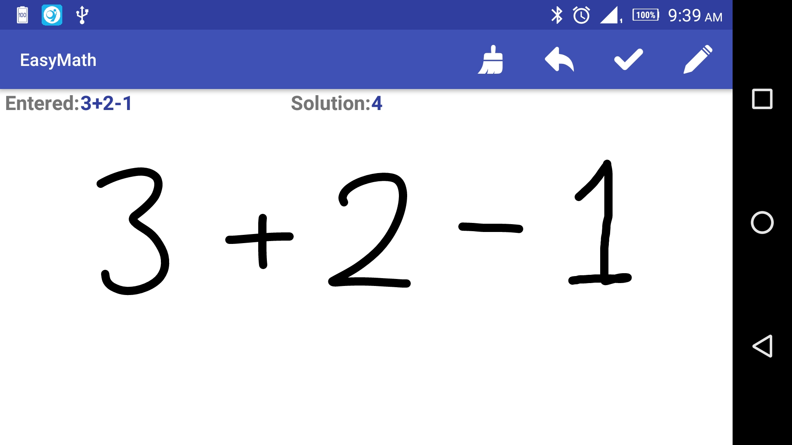
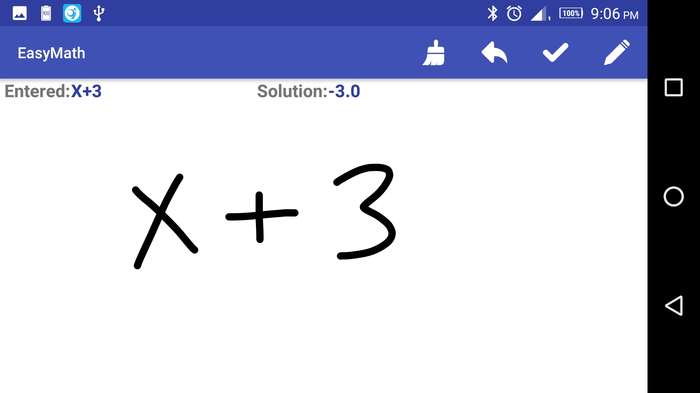
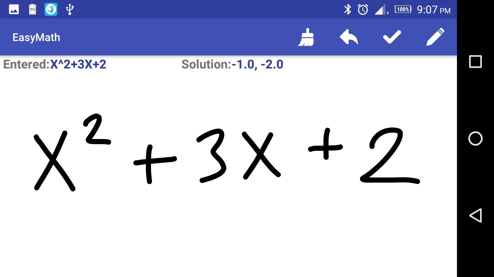
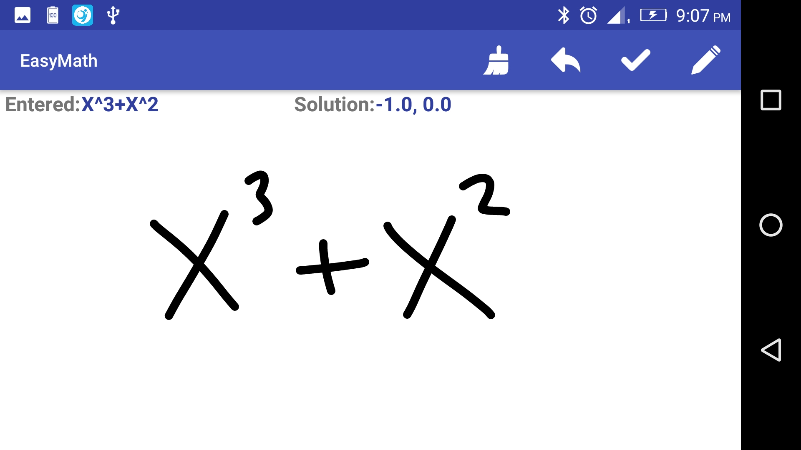

# EasyMath
EasyMath is an android application that solves arithmetic expressions or equations written by the user.

# How to use it
The user simply types what ever the arithmetic expression or equation he wants to solve, then presses "OK" button. 
After that the application will try to solve whatever the user entered and prints out the solution on the screen.

# What is supported
The user can only enter digits from "0" to "9", letter "X" as a variable, operator "+" and operator "-".
The application solves simple arithmetic expressions that include only plus or minus signs.
The application solves first, second and third order equations that include only variable "X".

# How it works
When the user enters what ever the arithmetic expression or equation he wants to solve and presses "OK" button, the 
app takes a screenshot of what the user had entered. Using opencv library, Some preprocessing is made to the image 
in order to separate, crop and resize each symbol. Using tensorflow model, Cropped symbols are classified into one 
of the classes. When the model finishes classifying all the symbols, It returns a string that contains the arithmetic 
expression or equation. This string is then passed to a solver that tries to get a solution.

# Screen shots of the app

# More about the preprocessing
preprocessing is made to the screenshot of what the user had entered. Operations include converting to gray scale, 
blurring, thresholding, inverting, rotating, finding contours, finding rectangles, cropping and resizing. Opencv 
library is used to perform all these operations.

# More about the model
The model has two convolutional layers and two fully connected layers. The model was trained on a dataset from Kaggle
and can classify symbols into exactly twenty-five classes. The classes are "-", "(" ,")" , "+", "0", "1", "2", "3", 
"4", "5", "6", "7", "8", "9", "C", "div", "E", "G", "L", "N", "O", "S", "sqrt", "X", "Y". The model is then freezed
and saved as ".pb" file. Tensorflow library is used so that the model is integrated within the application.
["**This is our tensorflow model**" ](https://github.com/MahmoudSelmy/MathRecognition)
